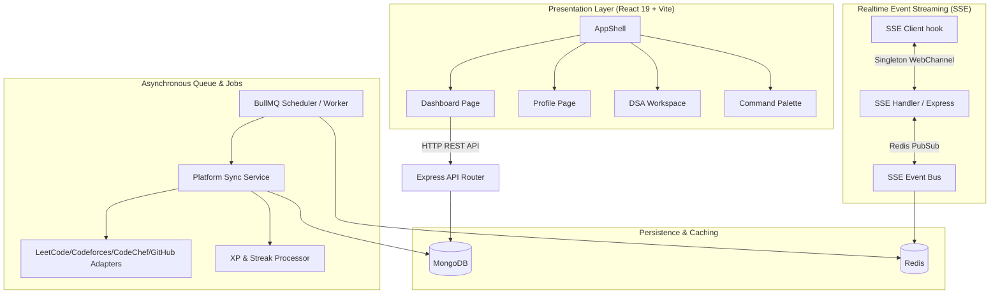

# System Architecture & Topology (ARCHITECTURE.md)

This document describes the architectural layout, realtime state streaming model, and asynchronous queue topology of DevTrack.

---

## 🗺️ Architectural Topology

DevTrack uses a decoupled, high-performance monorepo architecture separating a rich engineering-themed React frontend from a robust Express-based API. Background workloads are delegated to standalone asynchronous worker processes.

---

## 📡 Realtime Streaming: The Singleton SSE WebChannel

To bypass browser tab connection limits and reduce CPU/socket starvation, DevTrack implements a custom **Server-Sent Events (SSE) Singleton Pattern**:

1. **Client-Side Singleton Coordinator**:
   - Instead of opening an HTTP connection to `/api/events` per tab, a specialized manager controls connection registration globally.
   - React components listen to this stream using a centralized `useSyncExternalStore` hook, ensuring zero layout desynchronization across active tabs.
2. **Server-Side PubSub Event Bus**:
   - The Express server registers keep-alive SSE clients.
   - When background sync jobs finish processing, updates are broadcasted through a **Redis PubSub channel**. 
   - The SSE handler intercepts these events and pushes them to connected client channels instantly.

---

## ⚙️ Asynchronous Job Queue & Crawler Pipeline

Asynchronous tasks, competitive programming telemetry synchronization, and gamification processing are isolated entirely from the main Express HTTP thread:

1. **Scheduler Worker**:
   - Powered by **BullMQ** running on **Redis**.
   - Spawns platform crawl jobs on a configurable cron interval (defaulting to 15 minutes).
2. **Adapters & Scrapers**:
   - LeetCode, CodeChef, and Codeforces adapters crawl platform data (via GraphQL API and light Cheerio scraping if needed).
   - Ingestion is fully **idempotent**: each external submission maps to a unique compound identifier (`platform` + `externalId`) to avoid duplicate syncs.
3. **Progression Engine**:
   - Calculates experience points (XP), levels, and streaks dynamically based on the ingested submission count and platform difficulties.
   - Updates user profiles using Atomic MongoDB updates (`$inc`, `$set`, `$push`) to prevent race conditions.
