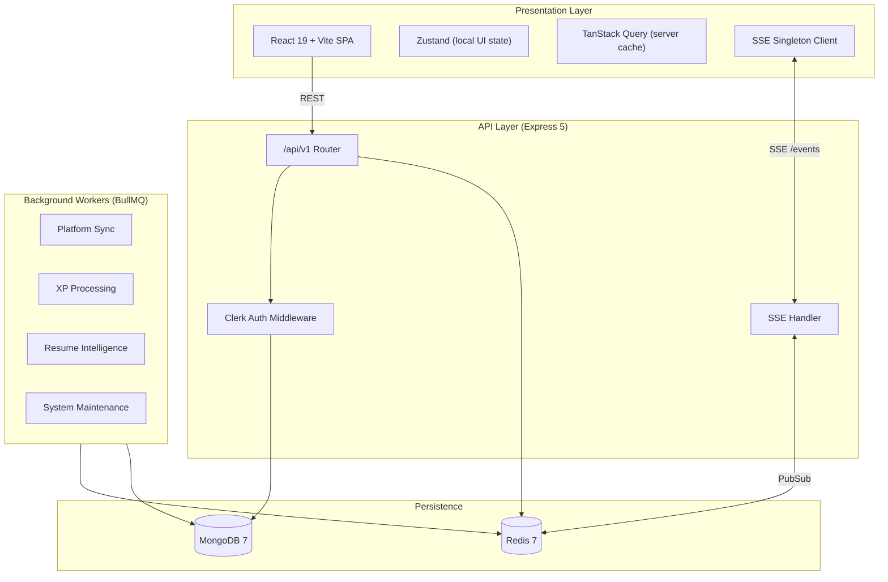

# System Architecture

DevTrack is a monorepo with a React SPA frontend, an Express API, and standalone BullMQ worker processes. Background work (platform sync, resume intelligence, XP) is isolated from the HTTP thread to keep API latency predictable.

---

## Topology



---

## Monorepo Layout

| Package | Entry | Role |
|---------|-------|------|
| `frontend/` | `src/main.tsx` | React SPA, Clerk auth, SSE client |
| `backend/` | `src/index.ts` | Express HTTP server |
| `backend/` | `src/worker-entrypoint.ts` | BullMQ worker dispatcher |
| `dev-orchestrator/` | `src/index.ts` | Local dev boot sequence |
| Root | `docker-compose.yml` | Container orchestration |

---

## API Versioning

- **Canonical path:** `/api/v1`
- **Legacy alias:** `/api` (returns deprecation header)
- **Infrastructure (unversioned):** `/health`, `/metrics`, `/api/system/*`

Defined in `backend/src/config/constants.ts`:

```ts
export const API_VERSION = 'v1';
export const API_BASE_PATH = '/api/v1';
```

---

## Authentication

DevTrack uses **Clerk** for authentication — not custom JWT.

| Layer | Mechanism |
|-------|-----------|
| Frontend | `@clerk/clerk-react` — sign-in/sign-up UI |
| Backend | `@clerk/express` middleware + `CLERK_SECRET_KEY` |
| User sync | `ClerkUserSyncService` creates/updates MongoDB user records on first request |
| SSE | `POST /api/v1/auth/sse-handshake` issues a short-lived token; `GET /api/v1/events?token=` |

Protected routes use `authMiddleware`. Admin and ops routes use `adminMiddleware` / `opsAuditorMiddleware`.

---

## Real-time: SSE Singleton Pattern

Browser tab limits make per-component SSE connections expensive. DevTrack uses a singleton coordinator:

1. **Client:** One shared connection managed via `useSyncExternalStore`; all tabs share the channel.
2. **Server:** Express registers keep-alive SSE clients in `sseHandler.ts`.
3. **PubSub:** Job completions broadcast through a Redis channel; the SSE handler pushes events to connected clients.

Event types include platform sync completion, XP updates, notification delivery, and runtime state changes.

---

## Background Job Queue

Powered by **BullMQ** on **Redis**. Workers run in separate processes (or containers in production).

### Queue names

| Queue | Purpose |
|-------|---------|
| `platform-sync` | LeetCode, Codeforces, CodeChef, GitHub crawlers |
| `xp-processing` | XP and level calculations |
| `streak-recalc` | Streak reconciliation |
| `notifications` | Notification dispatch |
| `profile-rebuild` | Profile stat reconstruction |
| `readiness-*` | Readiness snapshot and domain rebuilds |
| `resume-*` | Upload, ATS, semantic, embedding, credibility, variant, export |
| `system-maintenance` | Scheduled cleanup and reconciliation |
| `dataset-ingestion` | Dataset scan and ingest (ops) |

### Worker topology

**Development:** `npm run dev:workers` or `npm run dev:all`

**Production (`docker-compose.prod.yml`):**

| Container | `WORKER_TYPE` | Role |
|-----------|---------------|------|
| `api` | — (`ENABLE_WORKERS=false`) | HTTP + SSE only |
| `worker-sync` | `sync` | Platform crawlers |
| `worker-xp` | `xp` | Gamification |
| `worker-orch` | `orch` | Orchestration compensation |
| `worker-maint` | `maint` | Maintenance |

Platform sync is **idempotent**: each external submission maps to `platform + externalId` to prevent duplicates.

---

## Backend Modules

23 route modules mounted in `backend/src/routes/index.ts`:

| Module | Mount | Description |
|--------|-------|-------------|
| `auth` | `/auth` | Clerk user sync, SSE handshake |
| `dashboard` | `/dashboard` | Stats, streaks, missions, GitHub, activity |
| `dsa` | `/dsa` | Problems, stats, heatmap, submissions, contests |
| `activity` | `/activity` | Feed, heatmap, focus sessions |
| `projects` | `/projects` | Projects, tasks, GitHub sync |
| `profile` | `/profile` | User profile, platforms, public profiles |
| `settings` | `/settings` | User preferences |
| `platform-sync` | `/platforms` | Manual and scheduled sync |
| `xp` | `/xp` | Experience points |
| `streak` | `/streak` | Streak tracking and freeze |
| `ops` | `/ops` | Admin console, queues, DLQ, trust scores |
| `runtime-state` | `/runtime-state` | Unified runtime state rebuild |
| `observation` | `/observation` | Session replay, momentum, retention |
| `missions` | `/missions` | Daily/weekly missions |
| `notifications` | `/notifications` | In-app notifications |
| `onboarding` | `/onboarding` | Onboarding step tracking |
| `daily-challenge` | `/daily-challenge` | Daily challenge generation |
| `coaching` | `/coaching` | AI coaching insights |
| `readiness` | `/readiness` | Snapshots, intent, skill progress, DSA sub-routes |
| `resume` (upload) | `/resume` | File upload and session status |
| `resume-intelligence` | `/resume-intelligence` | ATS, variants, credibility, export |
| `recommendations` | `/recommendations` | Intelligence reports |
| `analytics` | `/analytics` | Event tracking, feedback, beta dashboard |

### Intelligence subsystems

Beyond route modules, these internal engines power resume and readiness features:

- `intelligence-runtime/` — Parsing, retrieval, credibility, replay
- `modules/ai/` — Provider adapters (OpenAI/Gemini), embeddings, retrieval
- `modules/ml/` — Ranking, governance, training pipelines
- `modules/validation/` — Load testing, scenario replay, benchmarking

---

## Database

**60+ Mongoose models** in `backend/src/db/models/`, grouped by domain:

| Domain | Models (examples) |
|--------|-------------------|
| User & Auth | `user`, `userProfile`, `userSettings` |
| DSA | `dsaProblem`, `dsaSubmission`, `dsaProfile`, `dsaContest` |
| Resume | `resumeProfile`, `resumeSession`, `atsAnalysis`, `embedding` |
| Readiness | `readinessCore`, `readinessRoadmap`, `careerIntent` |
| Activity | `activityEvent`, `focusSession`, `dailyActivity` |
| Gamification | `userXp`, `userStreakLog`, `mission`, `dailyChallenge` |
| Platform | `connectedPlatform`, `platformStats`, `syncJob` |
| Ops | `deadLetterJob`, `aiResponseAuditLog`, `behavioralTelemetry` |

Indexes are set up via `backend/src/db/migrations/index-setup.ts`.

---

## Frontend Architecture

### Routing

React Router v7 with lazy-loaded pages and `ErrorBoundary` wrappers. Protected routes sit behind `ProtectedLayout` + `AuthSyncGate` (Clerk → `/auth/me` sync).

### State management

| Type | Tool | Examples |
|------|------|---------|
| Server state | TanStack Query | Dashboard, DSA, readiness data |
| Client state | Zustand | Missions, gamification, UI overlays |
| Real-time | SSE hook | `useSse`, `RealtimeLayer` |

### Feature modules (`frontend/src/features/`)

`admin`, `ai`, `coaching`, `dashboard`, `dsa`, `gamification`, `intelligence-experience`, `notifications`, `onboarding`, `projects`, `readiness`, `realtime`, `resume-tracker`, `settings`

### API clients (`frontend/src/services/`)

16 service modules using `axiosClient` with Clerk token injection. Base URL from `VITE_API_BASE_URL`.

---

## Platform Integrations

| Platform | Method | Coverage |
|----------|--------|----------|
| Codeforces | REST API | Full submission history |
| GitHub | REST/GraphQL API | Repos, commits, stats |
| LeetCode | GraphQL (public) | Partial — API limitations |
| CodeChef | Web scraping | Stats only |

Optional `GITHUB_TOKEN` raises GitHub API rate limits.

---

## Observability

| Endpoint | Auth | Purpose |
|----------|------|---------|
| `GET /health` | Public | Liveness |
| `GET /health/detailed` | Admin | Deep health |
| `GET /metrics` | Admin | Prometheus text |
| `GET /api/v1/ops/*` | Admin/ops | Queues, DLQ, cache, trust, AI audits |

Structured logging via Winston (`backend/src/shared/logger.ts`). Failed jobs route to the dead-letter queue (`dlq.service.ts`).

---

## CI/CD

`.github/workflows/pr-checks.yml` on PRs to `main`/`develop`:

1. TypeScript compile + ESLint
2. Backend + frontend unit tests
3. Integration tests (Mongo 6 + Redis 7 service containers)
4. Docker image build verification

Production deploy workflows target **Railway** (backend) and **Vercel** (frontend).

---

## Related Docs

- [DEPLOYMENT.md](./DEPLOYMENT.md) — Production env vars and scaling
- [CONTRIBUTING.md](./CONTRIBUTING.md) — Module conventions
- [PROJECT_STATUS.md](./PROJECT_STATUS.md) — Current gaps and health
