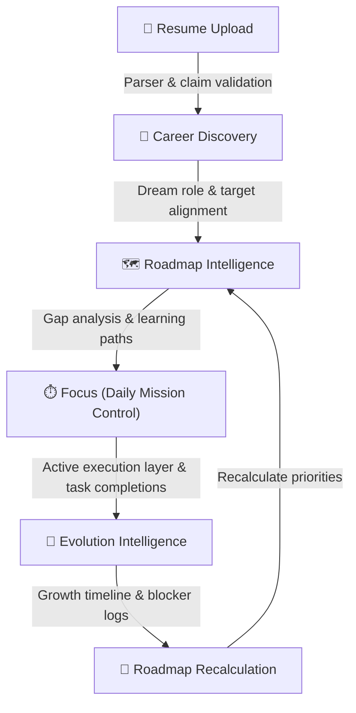
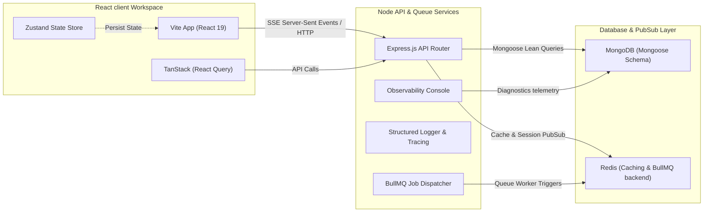

# 🌌 DevTrack: Developer Productivity & Career Readiness OS

> [!IMPORTANT]
> ### 🚀 DevTrack Beta Candidate Release
> This repository is currently in **Beta Candidate** status. All core components of the Unified Growth Loop are structurally complete, build-green, and undergoing active validation testing.

[](https://github.com/VarshithReddy2006/DevTrack)
[](https://www.typescriptlang.org/)
[](https://react.dev/)
[](https://expressjs.com/)
[](https://www.mongodb.com/)
[](https://redis.io/)

DevTrack is a high-performance, developer-centric monorepo platform designed to turn raw software engineering activity into an engaging, progression-based career readiness journey. By coupling deep resume intelligence, personalized learning path recommendations, and real-time activity telemetry with an interactive gamification loop, DevTrack helps developers close skill gaps, establish system design signals, and visually track their professional evolution.

---

## 📈 DevTrack Learning Workflow

DevTrack operates as a self-correcting, feedback-driven learning engine. The workflow dynamically maps skills, highlights engineering blockers, structures daily practice, and recalculates readiness goals:



1. **Resume Upload:** Import your resume to extract validated skills, projects, and deployment signals.
2. **Career Discovery:** Define your dream job role (e.g. Backend Developer) and target company tiers.
3. **Roadmap Intelligence:** Compare your current skill profile against industry standards to map missing dependencies and prioritized study milestones.
4. **Focus Mode (Daily Mission Control):** Organize your daily engineering tasks, complete milestone-aligned checklists, and record focus stats.
5. **Evolution Intelligence:** Review your interactive growth timeline, track milestone progression, and identify active roadblocks.
6. **Roadmap Recalculation:** As manual tasks and verification signals are logged, your target roadmap recalculates in real-time.

---

## 🔁 Unified Growth Loop

The core architecture of DevTrack centers on a closed-loop system: **Roadmap ➔ Focus ➔ Evolution ➔ Roadmap**.

This loop continuously recalculates your learning priorities:
* **Roadmap Analysis:** Gaps are computed by evaluating your parsed resume skills and manually completed achievements against target role requirements.
* **Focus Translation:** High-value gap skills are automatically translated into action recommendations and daily "Missions" on your Focus dashboard.
* **Evolution Logging:** When focus tasks or skills are completed, experience points (XP) are generated, streak counters advance, and progression milestones are registered.
* **Continuous Recalculation:** The progression engine recalculates target role alignment scores and adapts the remaining learning roadmap nodes dynamically to guide your next focus block.

---

## 🌟 Core Features

### 📄 Resume Intelligence
* **Resume Upload:** Multi-format workspace upload engine supporting PDF, DOCX, and text formats.
* **Resume Parsing & Skill Extraction:** Sophisticated parsing algorithms that extract technical skills, libraries, and project scopes.
* **ATS Analysis:** Real-time scoring evaluating ATS keywords, readability index, and industry compatibility.
* **Evidence Linkage:** Verifies resume claims by checking them against actual GitHub commits and project activities.

### 🎯 Career Discovery
* **Career Intent Setup:** Select career targets including target role, dream company tiers, compensation expectations, and timeline goals.
* **Target Role Selection:** Tailor readiness evaluation against specialized templates (e.g. Backend Developer, AI Engineer, DevOps).
* **Role Alignment Engine:** Dynamic alignment score mapping current skills against role requirements to yield an overall compatibility score.

### 🗺️ Roadmap Intelligence
* **Skill Gap Analysis:** Highlights which skills are validated (completed) and which are missing.
* **Priority Skills:** Identifies high-value skills to learn next to maximize your readiness score.
* **Next Skill Recommendation:** Computes dynamic recommendations based on current momentum and target role dependencies.
* **Learning Resources:** Automatically matches missing skills with curated tutorials, fallback community links, and practice projects.

### ⏱️ Focus Mode & Mission Control
* **Daily Mission Control:** Actively organize your coding tasks into named, categorized "Missions" with custom estimated durations and tags.
* **Task Progress Tracking:** Link specific tasks to a mission, track task completion ratios, and manage persistent task lists across sessions.
* **Skill Completion Tracking:** Toggle skill checklist states directly inside focus views to synchronize manual study milestones with your profile.
* **Learning Execution Layer:** Serves as the central staging area for daily technical work, utilizing integrated stopwatch and Pomodoro timers to capture execution velocity.
* **Zustand Persistence:** Mission states, active timers, and tasks persist during browser teardowns and restarts.

### 🧬 Evolution Intelligence
* **Growth Timeline:** Interactive chronological log capturing key events (e.g., Resume Uploaded, Career Discovery, Skill Mastered).
* **Career Progression Stages:** Track progression through three key phases: Foundation, Intermediate, and Advanced.
* **Milestones:** Visual progression meters mapping missing items against upcoming promotion criteria.
* **Blocker Analysis:** Dynamically isolates your primary engineering blocker and provides direct avenues for resolution.

### 📊 Analytics & Telemetry
* **Progress Events:** Deep instrumentation registering action clicks, resource visits, and task completions.
* **Feedback Collection:** Standard feedback forms for tracking UX quality and telemetry correctness.
* **Operations Beta Dashboard:** Secure administrative panel displaying system-wide PMF metrics, activation rates, user funnel conversions, and feedback logs.

---

## 🏗️ System Architecture

DevTrack's monorepo divides operations into distinct performance-isolated services:



* **Frontend Client (Vite + React 19):** Rich responsive single-page layouts. Uses Zustand for persistent local UI state and TanStack Query for server state cache caching.
* **Backend API (Express 5 + TypeScript):** RESTful endpoints with strict schemas, structured tracing, and rate-limiting.
* **Background Queue Worker (Redis + BullMQ):** Distributed workers processing heavy parsing tasks, LeetCode syncs, and AI reports away from the main thread.
* **Telemetry & Observability Console:** Performance logger capturing latency percentiles (P95/P99) and routing failed operations to the DLQ.

---

## 🛠️ Technology Stack

| Ecosystem | Technology | Description |
| :--- | :--- | :--- |
| **Frontend** | React 19, Vite, TypeScript | Client engine and state-of-the-art SPA layout. |
| **Styling** | CSS Variables | Dynamic Harmonious HSL colors and animations. |
| **State Management** | Zustand 5, TanStack Query 5 | Transient view caching and persistent localStorage states. |
| **Animations** | Framer Motion | Fluid micro-animations, spring-based transitions. |
| **Backend** | Express 5, TypeScript | Decoupled API service with strict request validators. |
| **Queue** | BullMQ + Redis | Background processing and platform crawlers. |
| **Database** | MongoDB via Mongoose | Core persistent database utilizing lean queries. |
| **Testing** | Vitest, Playwright | High-coverage unit, integration, and E2E browser tests. |

---

## 📁 Project Structure

```
DevTrack/
├── backend/                       # Express 5 API Server
│   ├── src/
│   │   ├── config/                # Environment config & Constants
│   │   ├── db/                    # Mongoose Models & Migrations
│   │   ├── middleware/            # Auth, Rate-limiter, Error Handlers
│   │   ├── modules/
│   │   │   ├── auth/              # JWT & Clerk user validation
│   │   │   ├── readiness/         # Skill Gap, Roadmap, & Evolution logic
│   │   │   ├── resume/            # PDF parsing & ATS Engines
│   │   │   └── operations/        # Diagnostics & Observability Console
│   │   └── shared/                # Redis clients, BullMQ Factory, Logger
│   └── package.json
├── frontend/                      # React 19 Client
│   ├── src/
│   │   ├── components/            # UI, Layouts, AppShell, ErrorBoundary
│   │   ├── features/
│   │   │   └── readiness/         # Evolution & Roadmap components/hooks
│   │   ├── pages/
│   │   │   ├── admin/             # Beta program dashboards
│   │   │   ├── readiness/         # Roadmap, DSA & Evolution interfaces
│   │   │   └── FocusPage.tsx      # Pomodoro stopwatch stopwatch
│   │   ├── store/                 # Persistent Zustand state machines
│   │   └── services/              # API Client wrappers
│   └── package.json
├── dev-orchestrator/              # Multi-process dev orchestrator
├── docker-compose.yml             # Docker config for MongoDB & Redis
└── package.json                   # Monorepo configuration
```

---

## 🚀 Installation & Local Setup

### System Prerequisites
- **Node.js:** `>= 18.0.0`
- **npm:** `>= 9.0.0`
- **Docker Desktop:** Installed & running

### Step-by-Step Launch

1. **Clone the Repository:**
   ```bash
   git clone https://github.com/VarshithReddy2006/DevTrack.git
   cd DevTrack
   ```

2. **Boot Core Database & Caching Services (Docker):**
   Ensure Docker is active, then spin up MongoDB and Redis in detached mode:
   ```bash
   npm run dev:infra
   ```
   *Exposes MongoDB on `localhost:27017` and Redis on `localhost:6379`.*

3. **Establish Local Environment Files:**
   Establish local parameters for both Backend and Frontend:
   ```bash
   # In root directory:
   cp .env.example .env
   
   # In backend directory:
   cp backend/.env.example backend/.env
   
   # In frontend directory:
   cp frontend/.env.example frontend/.env
   ```

4. **Install Monorepo dependencies:**
   Recursively install all dependencies for API, Frontend, and Workers:
   ```bash
   npm run install-all
   ```

5. **Start Dev Servers:**
   Boot client and server concurrently in watch mode:
   ```bash
   npm run dev
   ```
   - **Frontend UI:** `http://localhost:5173`
   - **Backend API:** `http://localhost:3001`

---

## 🖼️ Application Telemetry (Screenshots)

*Note: Visual placeholders represent production UI features.*

### 📊 1. Engineering OS Dashboard

*Central command console featuring total XP meters, recent DSA activity grids, active task widgets, and real-time SSE telemetry widgets.*

### 🗺️ 2. Roadmap Intelligence

*Adaptive learning pathway mapping out validated vs. missing skills, next recommended competencies, weekly effort forecasts, and matching project resources.*

### ⏱️ 3. Focus Mode & Mission Control

*Daily task planners with stopwatches and Pomodoro cycles to log and categorize focused coding blocks.*

### 🧬 4. Evolution Intelligence

*Chronological development graphs documenting verified accomplishments and primary blocker mitigation targets.*

### 📄 5. Resume Analysis Center

*ATS optimization dashboard evaluating CV uploads and comparing claimed proficiencies against active code proofs.*

---

## 💻 Development Workflow

### 🌿 Git Branch Strategy
All development operates inside strict branch structures to safeguard release status:
* **`main`:** Stable production branch. Always deployable.
* **`feature/<name>`:** Specific functionality sandbox (e.g. `feature/unified-growth-loop`).
* **`hotfix/<name>`:** Immediate production patches.

### 📝 Commit Message Conventions
Commits are parsed by automated pipelines and must follow standard formats:
* `feat(readiness): add roadmap gap analyzer` (New feature)
* `fix(auth): correct token expiry check` (Bug fix)
* `chore(repo): update typescript to v5.9` (Maintenance)
* `test(ops): add DLQ resilience test cases` (Testing)

### 🧪 Automated Testing
DevTrack utilizes strict unit and E2E verification suites:
```bash
# Exute unit and smoke tests
npm run test

# Run Playwright End-to-End browser tests (in frontend folder)
npm run test:e2e
```

---

## 🏁 Current Development Status

### **Status:** **Beta Candidate**

### **Factual Build Status:**
* **Backend API:** 🟢 **BUILD GREEN** — `tsc -p tsconfig.json` compiles successfully with zero compiler errors. Factual testing verification complete for core models, schemas, and adapter crawlers.
* **Frontend Client:** 🟢 **BUILD GREEN** — `tsc -b && vite build` built client bundles successfully in **1.95s**. Factual testing verification complete for persistent Zustand stores and React 19 rendering components.
* **Database Schemas:** 🟢 **BUILD GREEN** — MongoDB schemas configured with strict compound validation checks and Mongoose indexes.

### **Implemented Features:**
* **Resume Intelligence:** PDF/DOCX file parser, ATS scoring engine, extraction schema mapper.
* **Career Discovery:** Interactive target intent inputs (dream role, target company, commitment hours).
* **Roadmap Intelligence:** Deterministic gap analysis, priority recommended skills, learning resource bindings.
* **Focus Mission Control:** persistent daily missions, checklist task managers, skill check synchronization.
* **Evolution Intelligence:** Growth timelines, career progression phase mapping, primary blockers mitigation.
* **Analytics Dashboard:** Funnel activity stats tracking, written feedback logs portal, system latency telemetry monitors.

### **In Active Validation:**
* **End-to-end workflow verification:** Logging active sessions across multi-tab single-channel streams.
* **Timeline progression testing:** Confirming milestone criteria incrementations.
* **Growth loop telemetry validation:** Validating continuous gap-alignment calculations.

### **Known Limitations:**
* **Local Ingestion Limits:** Third-party crawl APIs are subject to remote rate-limiting triggers. Optional `GITHUB_TOKEN` advised to maintain pipeline throughput.
* **File Upload Thresholds:** Resume parsing payloads capped at `5MB`.
