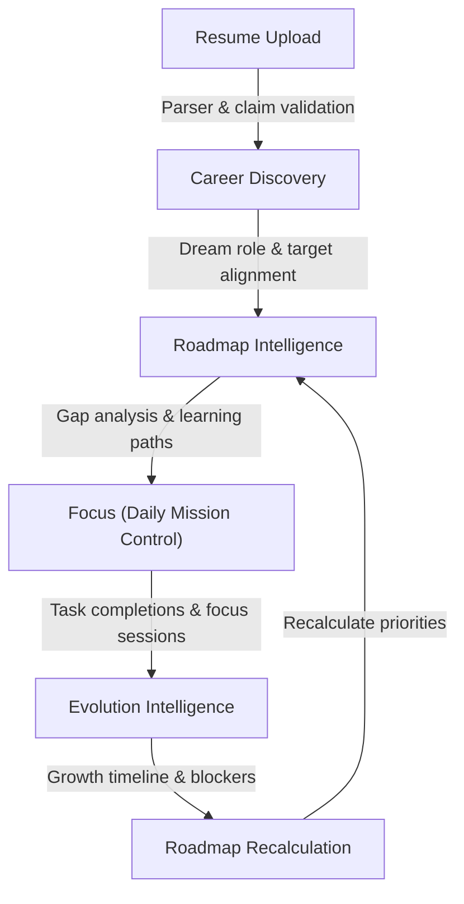

# DevTrack: Developer Productivity & Career Readiness OS

> **Beta Candidate** — Core platform features are structurally complete, build-green, and undergoing active validation.

[](https://www.typescriptlang.org/)
[](https://react.dev/)
[](https://expressjs.com/)
[](https://www.mongodb.com/)
[](https://redis.io/)

DevTrack is a monorepo platform that unifies DSA progress tracking, project management, resume intelligence, career readiness scoring, and gamification into one developer-centric workspace. It ingests activity from LeetCode, Codeforces, CodeChef, and GitHub, then turns that signal into actionable missions, readiness scores, and real-time dashboard updates.

---

## What DevTrack Does

| Area | Capabilities |
|------|-------------|
| **DSA Workspace** | Problem tracking, favorites, heatmaps, submissions, contests, topic analytics |
| **Platform Sync** | Scheduled ingestion from LeetCode, Codeforces, CodeChef, GitHub |
| **Projects** | CRUD projects and tasks, velocity stats, GitHub sync |
| **Focus Mode** | Daily missions, Pomodoro/stopwatch timers, persistent task lists |
| **Resume Intelligence** | PDF/DOCX upload, ATS scoring, evidence claims, credibility, variants, export |
| **Readiness OS** | Skill gaps, career intent, roadmap, DSA intelligence, evolution timeline, AI copilot |
| **Gamification** | XP, levels, streaks (with freeze), missions, daily challenges |
| **Real-time** | SSE event stream for live dashboard and notification updates |
| **Admin / Ops** | Beta metrics, queue management, DLQ replay, trust scores, AI audits |

---

## Learning Workflow

DevTrack operates as a feedback-driven career readiness engine:



The closed loop is **Roadmap → Focus → Evolution → Roadmap**. Gaps drive missions; completed work earns XP and updates readiness scores; the roadmap adapts in response.

---

## Tech Stack

| Layer | Technologies |
|-------|-------------|
| **Frontend** | React 19, Vite 8, TypeScript, Tailwind CSS 4, Framer Motion, Zustand, TanStack Query, Axios, Clerk |
| **Backend** | Express 5, TypeScript, Mongoose, Zod, BullMQ, Clerk Express |
| **Data** | MongoDB 7, Redis 7 |
| **AI** | OpenAI, Google Gemini (embeddings, coaching, resume intelligence) |
| **Testing** | Vitest (unit + integration), Playwright (E2E) |
| **Infra** | Docker Compose, GitHub Actions CI, Railway + Vercel (production) |

---

## Project Structure

```
DevTrack/
├── backend/                  # Express 5 API + BullMQ workers
│   └── src/
│       ├── config/           # env.ts, constants.ts
│       ├── db/models/        # 60+ Mongoose models
│       ├── middleware/       # Clerk auth, rate limits, validation
│       ├── modules/            # 23 domain modules (dsa, resume, readiness, …)
│       ├── routes/             # Route composition
│       ├── shared/             # Redis, BullMQ, SSE, logger
│       ├── workers/            # Standalone worker entrypoints
│       └── __tests__/          # Unit + integration tests
├── frontend/                 # React 19 SPA
│   └── src/
│       ├── components/       # UI, layout, dashboard, DSA, focus
│       ├── features/         # Domain feature modules
│       ├── pages/            # Route-level pages
│       ├── services/         # Axios API clients
│       ├── store/            # Zustand stores
│       └── router/           # React Router v7
├── dev-orchestrator/         # Local multi-process dev boot
├── Codex/                    # AI agent reference package
├── docker-compose.yml        # Dev full-stack (mongo, redis, api, frontend)
├── docker-compose.prod.yml   # Production split (api + workers)
├── start-dev.ps1             # Windows dev environment starter
└── package.json              # Monorepo scripts
```

---

## Quick Start

### Prerequisites

- Node.js `>= 18`, npm `>= 9`
- Docker Desktop (for MongoDB + Redis)

### 1. Clone and install

```bash
git clone https://github.com/VarshithReddy2006/DevTrack.git
cd DevTrack
npm run install-all
```

### 2. Environment files

```bash
cp backend/.env.example backend/.env
cp frontend/.env.example frontend/.env
```

Required variables:

| File | Variable | Purpose |
|------|----------|---------|
| `backend/.env` | `CLERK_SECRET_KEY` | Clerk backend auth |
| `frontend/.env` | `VITE_CLERK_PUBLISHABLE_KEY` | Clerk frontend auth |
| `frontend/.env` | `VITE_API_BASE_URL` | API base (default `http://localhost:3001/api`) |

Optional: `GITHUB_TOKEN`, `OPENAI_API_KEY`, `GEMINI_API_KEY` for sync and AI features.

### 3. Start infrastructure

```bash
npm run dev:infra
```

Starts MongoDB on `localhost:27017` and Redis on `localhost:6379`.

### 4. Run the app

**Option A — API + frontend only (no workers):**

```bash
npm run dev
```

**Option B — Full stack with workers (recommended):**

```bash
npm run dev:all
```

**Option C — Windows PowerShell helper:**

```powershell
.\start-dev.ps1
```

| Service | URL |
|---------|-----|
| Frontend | http://localhost:5173 |
| Backend API | http://localhost:3001 |
| Health check | http://localhost:3001/health |

### 5. Full Docker stack

```bash
docker compose up --build
```

---

## API Overview

Canonical base path: **`/api/v1`**. Legacy `/api/*` routes still work with a deprecation header.

| Module | Path prefix | Auth |
|--------|-------------|------|
| Auth | `/auth` | Clerk JWT |
| Real-time | `/events` | SSE token handshake |
| Dashboard | `/dashboard` | Yes |
| DSA | `/dsa` | Yes |
| Activity | `/activity` | Yes |
| Projects | `/projects` | Yes |
| Profile | `/profile` | Yes (public `/profile/public/:username`) |
| Platform Sync | `/platforms` | Yes |
| Readiness | `/readiness` | Yes |
| Resume | `/resume`, `/resume-intelligence` | Yes |
| XP / Streak / Missions | `/xp`, `/streak`, `/missions` | Yes |
| Ops (admin) | `/ops` | Admin / ops auditor |

See [ARCHITECTURE.md](./ARCHITECTURE.md) for the full endpoint list and system topology.

---

## Frontend Routes

| Path | Page |
|------|------|
| `/dashboard` | Engineering OS dashboard |
| `/focus` | Mission control + timers |
| `/dsa` | DSA workspace |
| `/projects` | Project tracker |
| `/resume` | Resume upload workspace |
| `/resume/analysis/:sessionId` | Resume analysis |
| `/readiness` | Readiness hub |
| `/readiness/dsa`, `/roadmap`, `/evolution`, `/copilot` | Intelligence workspaces |
| `/profile`, `/u/:username` | User profile |
| `/settings` | Settings |
| `/admin`, `/beta/dashboard` | Admin consoles |

---

## Development Commands

| Command | Description |
|---------|-------------|
| `npm run dev` | Frontend + backend concurrently |
| `npm run dev:all` | Full orchestrator (infra + API + workers + frontend) |
| `npm run dev:infra` | Docker mongo + redis only |
| `npm run dev:workers` | BullMQ workers only |
| `npm run health:check` | Environment and connectivity checks |
| `npm run clean:runtime` | Kill stale processes and clear ports |
| `npm run test` | Backend Vitest suite |
| `cd frontend && npm run test:e2e` | Playwright E2E tests |
| `docker compose up --build` | Full containerized stack |

---

## Testing

```bash
# Backend unit tests
cd backend && npm run test:unit

# Backend integration tests (requires Mongo + Redis)
cd backend && npm run test:integration

# Frontend unit tests
cd frontend && npm run test:unit

# Frontend E2E (requires running stack + AI keys)
cd frontend && npm run test:e2e
```

CI runs typecheck, lint, unit tests, integration tests, and Docker build verification on every PR (`.github/workflows/pr-checks.yml`).

---

## Documentation Index

| Document | Contents |
|----------|----------|
| [ARCHITECTURE.md](./ARCHITECTURE.md) | System topology, SSE, queues, modules |
| [DEPLOYMENT.md](./DEPLOYMENT.md) | Production deployment and env vars |
| [CONTRIBUTING.md](./CONTRIBUTING.md) | Code conventions and PR requirements |
| [PROJECT_STATUS.md](./PROJECT_STATUS.md) | Current build status and known gaps |
| [CLAUDE.md](./CLAUDE.md) | AI assistant project context |
| [dev-orchestrator/README.md](./dev-orchestrator/README.md) | Local orchestrator details |
| [frontend/e2e/README.md](./frontend/e2e/README.md) | E2E test philosophy and setup |

---

## Known Limitations

- **LeetCode sync** is partial due to public API constraints.
- **CodeChef** provides stats only (no full submission history).
- **ATS integrations** use simulators; no live Workday/Greenhouse OAuth.
- **Resume uploads** are capped at 5 MB.
- **AI features** degrade gracefully when `OPENAI_API_KEY` / `GEMINI_API_KEY` are unset.

---

## License

Private beta — see repository owner for licensing terms.
