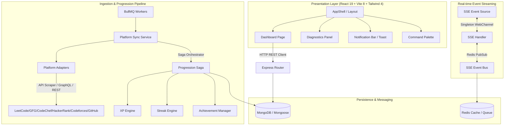

# 🌌 DevTrack: Elite Developer Productivity & Engineering Gamification OS

DevTrack is a high-performance, developer-centric monorepo platform designed to aggregate engineering activity, track daily productivity, and gamify achievements. By integrating competitive programming platforms with real-time analytics and a rich telemetry UI, DevTrack turns software engineering into an engaging, progression-based experience.

---

## 🚀 Key Capabilities

*   **Engineering OS Dashboard:** A sleek, dark-mode, glassmorphism-based developer dashboard with platform telemetry, daily coding velocity graphs, systems status bars, and active widgets.
*   **Deep Competitive Programming (DSA) Sync:** Multi-platform crawlers and GraphQL adapters that ingest profile statistics, contests, and problem solving data across **LeetCode**, **Codeforces**, **CodeChef**, **HackerRank**, **GeeksforGeeks (GFG)**, and **GitHub**.
*   **Dynamic Rolling Heatmap:** A visual calendar heatmap tracking submissions and commits across all platforms on a unified rolling grid.
*   **Background Progression Saga Pipeline:** A transactional processing system backed by **BullMQ** and **Redis** that computes experience points (XP), levels, coding streaks, and badges with automatic rollback (compensation triggers) in case of database failures.
*   **High-Coherence SSE WebChannel:** Real-time server-push state synchronization over a Server-Sent Events (SSE) singleton channel, ensuring multi-tab browser instances share a single connection to bypass browser tab connection limits.
*   **Command Palette Navigation:** A quick-action command palette (`Ctrl+K` / `Cmd+K`) for lightning-fast workspace navigation, system diagnostics, and settings management.

---

## 🏗️ System Architecture Topology

DevTrack uses a decoupled, monorepo architecture separating a rich **React 19** frontend from a robust **Express 5** + **MongoDB** + **Redis** backend. Background operations, platform indexing, and gamification processing are delegated to isolated **BullMQ workers**.



---

## 🛠️ Technology Stack & Ecosystem

### 💻 Backend (API & Ingestion)
*   **Core Platform:** Node.js, TypeScript, Express.js (v5.1)
*   **Database:** MongoDB via Mongoose (with compound indexing, strict schema schemas, and `.lean()` read paths)
*   **Distributed Queue & Cache:** Redis + BullMQ (for asynchronous background ingestion, cron operations, and saga compensation tasks)
*   **Web Scraping & Fetching:** Cheerio + Axios (for robust scraping on platforms lacking public APIs)
*   **Testing Suite:** Vitest (smoke, unit, and algorithm integrity tests)
*   **Environment & Execution:** tsx (TypeScript execution engine), Winston Logger, Helmet (security headers)

### 🎨 Frontend (Engineering UI)
*   **Client Core:** React 19, Vite 8, TypeScript, Tailwind CSS v4 (fully customized PostCSS build)
*   **State & Caching:** Zustand v5 (transient UI, sidebar, modal states), TanStack Query v5 (React Query for server state caching and client validation)
*   **Animations:** Framer Motion v12 (premium micro-animations, radar scanners, orbital physics, and spring-based layouts)
*   **Iconography:** Lucide React
*   **Routing:** React Router DOM v7

---

## ⚡ The Progression & Sync Saga Pipeline

To guarantee 100% data integrity and prevent double-XP exploits, progression calculations run inside a transaction-like **Saga pipeline**:

1.  **Platform Fetching:** Adapters query platform graphs. If competitive coding sites are down, adapters cleanly fall back to cached delta matrices or mock parameters.
2.  **Anti-Abuse Validation:** System screens solve velocity. Impossible submission rates (e.g., 50 problems in 1 second) trigger quarantine flags.
3.  **Idempotence Filtering:** Submissions are indexed using a compound key (`platform` + `externalId`), ensuring unique entry.
4.  **Compensation Actions:** If any downstream step fails (e.g. user level upgrades succeed but achievement unlock fails), the orchestration worker fires a rolling rollback trigger to restore the user's previous metrics.

---

## 📡 The Singleton SSE WebChannel

Multiple open browser tabs normally cause browser socket floods, socket starvation, and excessive server load. DevTrack bypasses this using an **SSE Singleton Pattern**:

*   **One Connection per Browser:** A specialized client-side controller coordinates all tabs to open exactly one single event stream channel (`/api/events`).
*   **Shared External Store:** React hooks (`useSse`) tap into a central `useSyncExternalStore` mechanism.
*   **Auto Teardown:** Whenever all tabs are closed or sub-components unmount, the WebChannel cleanly tears down the SSE listener to prevent resource leaks.

---

## 📏 Directory & Coding Conventions

The monorepo maintains high consistency by grouping features into cohesive, self-contained domains.

### Backend Module Design Pattern
All backend features in `backend/src/modules/` reside in domain-specific folders containing:
```
backend/src/modules/<name>/
├── index.ts          # Default barrel exports
├── <name>.routes.ts  # Express Router declarations
├── <name>.controller.ts # Request validating & HTTP responses
├── <name>.service.ts    # Database transactions & core operations
└── <name>.validation.ts # Zod request payloads schema
```

### Frontend Architecture Conventions
*   `src/components/`: Pure, reusable presentational UI elements.
*   `src/features/`: Complex page-specific sub-features (e.g. `settings`, `commandpalette`).
*   `src/store/`: Zustand hooks for client UI state (sidebar toggles, command palette modals).
*   `src/hooks/`: Custom state controllers (`useXp`, `useSse`) and Query hooks mapping to `src/services/`.

---

## 💻 Local Setup & Development

### System Requirements
*   **Node.js:** `>= 18.0.0`
*   **npm:** `>= 9.0.0`
*   **Docker Desktop:** Installed & running (for local MongoDB & Redis services)

### Quick Start (Monorepo Bootstrapping)

1.  **Clone the Repository:**
    ```bash
    git clone https://github.com/VarshithReddy2006/DevTrack.git
    cd DevTrack
    ```

2.  **Spin up Core Infrastructure (Docker):**
    Ensure Docker is running, then launch MongoDB and Redis:
    ```bash
    npm run docker:up
    ```
    *This exposes MongoDB on `localhost:27017` and Redis on `localhost:6379`.*

3.  **Configure Environment Variables:**
    Copy the example template to `.env` in the root:
    ```bash
    cp .env.example .env
    ```
    Edit `.env` and fill out your local parameters (and optionally a `GITHUB_TOKEN` to prevent GitHub rate-limiting).

4.  **Install Dependencies:**
    DevTrack is a fully integrated monorepo. Use the workspace bootstrap script to install root, frontend, and backend packages:
    ```bash
    npm run install-all
    ```

5.  **Start Local Development Servers:**
    Launch the Express API and Vite client concurrently:
    ```bash
    npm run dev
    ```
    *   **Frontend:** `http://localhost:5173`
    *   **Backend:** `http://localhost:3001`
    *   **SSE Channel:** `http://localhost:3001/events`

---

## 📜 Monorepo Command Reference

All workspace operations can be controlled directly from the root `package.json` utilizing `concurrently`:

| Command | Action |
| :--- | :--- |
| `npm run install-all` | Runs `npm install` recursively in the root, `/frontend`, and `/backend` |
| `npm run dev` | Spins up the Frontend client and Backend API servers in concurrent watch mode |
| `npm run build` | Compiles both Frontend and Backend workspaces for production deployment |
| `npm run test` | Runs the test suite on the backend using Vitest |
| `npm run docker:up` | Builds and launches MongoDB & Redis containers with automated health checks |
| `npm run docker:down` | Gracefully shuts down and purges local Docker containers |
| `npm run clean` | Recursively wipes out `node_modules` folders to trigger a fresh install |

---

## 📈 Production Scaling & Isolated Workers

In a production environment, running background crawlers, scrapers, and XP engines inside the HTTP web container creates a single point of failure (a worker crash could bring down the entire public API).

DevTrack resolves this through **Isolated Worker Processes** controlled via the `WORKER_TYPE` environment variable in `backend/src/worker-entrypoint.ts`.

### Independent Scaling Topology
In Kubernetes or Docker Swarm, you can scale the API and background workers independently:

1.  **API Web Container:**
    ```bash
    # Starts index.ts. Standard HTTP traffic container. Exposes /api/*
    npm run start
    ```

2.  **Standalone Worker Container:**
    ```bash
    # Runs worker-entrypoint.ts. Isolated from HTTP request limits.
    WORKER_TYPE=all npm run worker
    ```

### Supported Worker Modes
You can configure a container to only handle specific types of background tasks by setting `WORKER_TYPE` to one of the following:

*   `sync`: Dedicated purely to platform scraper crawls (LeetCode, CodeChef, etc.).
*   `xp`: Dedicated to parsing progression actions, calculating user points, and triggering level upgrades.
*   `orchestration`: Focuses on processing compensation rollbacks in case of database transaction failures.
*   `maintenance`: Runs cron-like routines (clearing stale logs, checking platform heartbeat health).
*   `all` (Default): Boots up all workers simultaneously in a single process (ideal for simple Docker Compose deployments).

---

## 🧪 Testing & Diagnostics

DevTrack emphasizes high runtime resilience. The testing suite uses **Vitest** for fast unit and smoke evaluations:

```bash
# Execute backend tests
npm run test
```

### Key Validation Tests:
*   `src/__tests__/smoke.test.ts`: Rapid health evaluations of express setups and mongoose schemas.
*   `src/__tests__/date.test.ts`: Validates date intervals and time zones during submission syncing.
*   `src/modules/dsa/dsa_rolling.test.ts`: Confirms mathematical accuracy of the DSA sliding submission heatmap.

---

## 🎨 Design System & Visual Telemetry Tokens

DevTrack's UI relies on a premium, ultra-engineered visual style with precise aesthetic tokens defined in `frontend/src/design-system/tokens/index.ts`:

*   **Color Accents:** A base deep space layout (`#0A0A0B`) styled with bright, vivid accents: matrix green (`#00E676`) for success telemetry, sky cyan (`#00B0FF`) for sync indicators, and hot pink (`#FF1744`) for errors.
*   **Depth Geometry:** Organically layered glassmorphism panels with high-performance backdrop blurs (`blur(24px) saturate(180%)`) and sub-pixel organic border radius bounds.
*   **Telemetry Grids:** Subtly overlayed vector grids (`rgba(255, 255, 255, 0.02)`) styled with conic scanning gradient loops simulating real-time activity radar scans.
